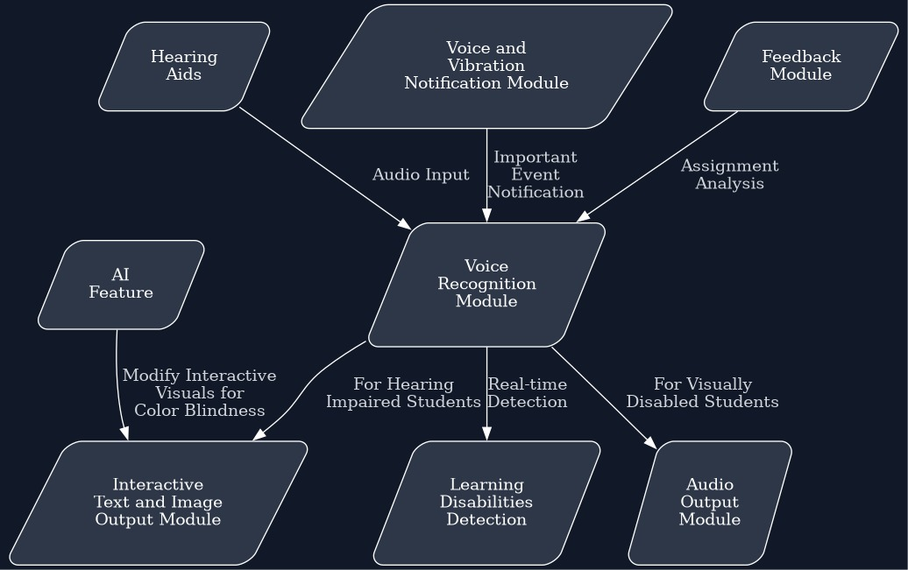
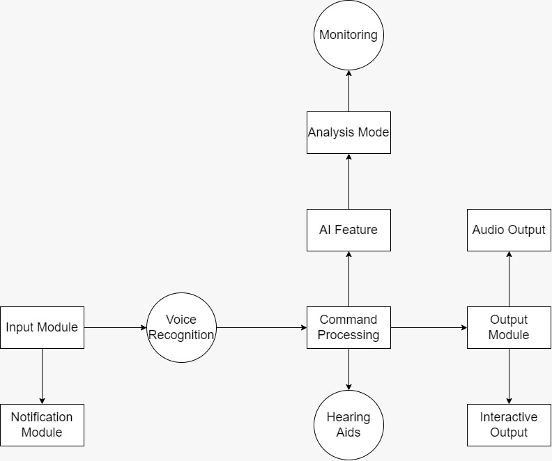

# intel-oneAPI

#### Team Name - INTELlectuals
#### Problem Statement - Open Innovation in Education
#### Team Leader Email - navaprettam.n214@gmail.com

## A Brief of the Prototype:
  This section must include UML Daigrms and prototype description

  
  
  
  
## Tech Stack: 
   List Down all technologies used to Build the prototype **Clearly mentioning Intel® AI Analytics Toolkits, it's libraries and the SYCL/DCP++ Libraries used**
   
  - Intel oneAPI Deep Neural Network Library (oneDNN) - This library is used to implement the AI feature that analyzes the assignment submitted by the student and provides active feedback to improve the outcome.
  - Intel oneAPI Math Kernel Library (oneMKL) - This library is  used to accelerate numerical computations required for processing the assignment submissions and providing feedback.
  - Intel oneAPI Threading Building Blocks (oneTBB) - This library is  used to implement the parallel processing of tasks required for constant monitoring of students to detect learning disabilities and recommend programs based on them.
  - Intel oneAPI Video Processing Library (oneVPL) - This library is used to enable the video processing feature of the application, such as video transcoding, decoding, and encoding.
  - Intel oneAPI Collective Communications Library (oneCCL) - This library is used to implement distributed computing to support the scalability of the application.
  - SYCL OpenCL Interoperability (sycl-gtx) - This library is used to interface with OpenCL libraries required for accessing the GPU to support the AI-based features of the application.
  - SYCL OpenCV Interoperability (sycl-opencv) - This library is used to interface with OpenCV libraries required for image and video processing, including detecting and modifying interactive visuals for students with color blindness.
  - SYCL ML Interoperability (sycl-ml) - This library is  used to interface with machine learning libraries required for implementing the AI-based features of the application, such as analyzing assignment submissions and providing feedback.
  - SYCL Media Interoperability (sycl-media) - This library is used to interface with media libraries required for processing media files, such as audio and video files, to enable features such as audio output for visually disabled students and interactive text and image-based output for students with hearing impairments.
## Step-by-Step Code Execution Instructions:
  This Section must contain set of instructions required to clone and run the prototype, so that it can be tested and deeply analysed
  
## What I Learned:
   Write about the biggest learning you had while developing the prototype
